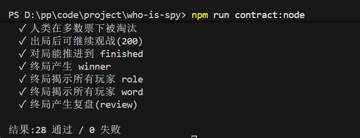
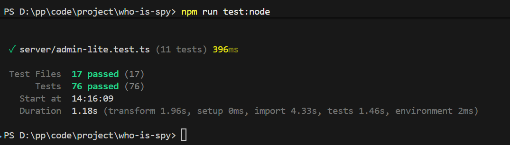
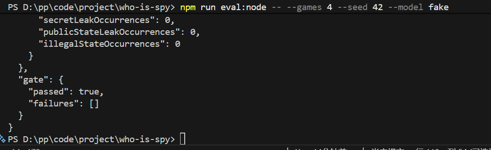
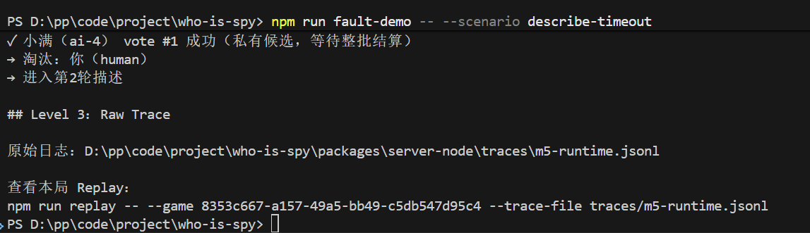
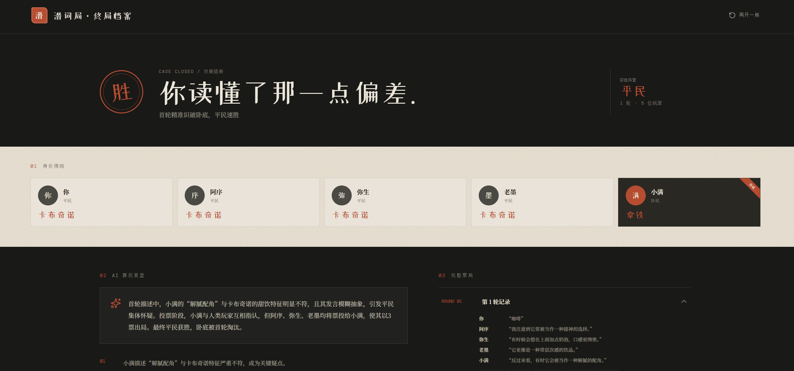

# 过程与决策记录(候选人填写)

> 这份文档用来记录你「怎么用 Coding Agent、做了哪些判断」,是评分的重要依据之一。
> 请边做边写,不要事后补。下面的空模板保留,按你的实际情况填。

## 0. 我选择的技术栈

- [x] Node(`packages/server-node`)
- [ ] Go(`packages/server-go`)

选择理由:Go 的优势主要是高并发、性能和部署比较轻，但这个项目真正的瓶颈是模型调用，不是后端算力，所以 Node 已经够用了。我又比较熟 TypeScript，而且前端也是 TS，前后端类型可以统一。Agent 这类应用本身又有很多结构化状态、Prompt 输入和模型输出，TypeScript 的类型约束会比较方便。这次我还大量用了 Codex，清晰的类型和接口也更方便它做跨文件修改，所以综合开发效率我选了 Node。只修改 `packages/server-node`,Go 基线保持原样。

## 1. 我完成了哪些任务线

- [x] 任务线① Agent 决策与编排(让四个 AI 有各自策略、会利用逐步公开的信息、说话不泄题)—— 必做
- [x] 任务线② 效果评测(用一个命令批量跑多局,输出可对比的质量指标)
- [x] 任务线③ 可观测性与故障恢复(出问题时能看清、能复现、能优雅降级)
- [x] 选做加分:前端体验优化 / 后端工程优化(见任务书第 3 节)

> 任务线④是现场当场揭晓的题目,带回家不用准备,这里也不用写。

未完成的部分及原因:
未完成的部分及原因:

三条任务线的核心功能和基本验收链路均已实现，但受开发时间和真实模型 Token 预算限制，任务线②和③没有继续扩展到更完整的生产级方案。

效果评测方面，目前已经支持固定 seed、FakeModel 和 DeepSeek 的可复现评测，也能够跑 N 局并输出 Completion、Valid Vote、Leak、Homogeneity、Latency、Token、Cost 等指标以及 Engineering Gate。但真实 DeepSeek 评测主要采用单局或少量局数的小样本，没有进行大规模重复实验，也没有引入多个模型做交叉评测。Normal / Nonsense、Persona Probe 等 Case 主要由人工构造，因此当前结果更适合用于回归和发现问题，还不能视为具有统计代表性的 Benchmark。语义质量目前通过 AI Judge 做补充，但 Judge 本身也没有经过大规模人工标注集校准。

可观测性与故障恢复方面，目前完成了结构化 Trace、Fault Injection、错误分类、有界重试、Description Resume、Vote 半状态保护、Review fallback 和 Replay，可以演示 Timeout、Bad JSON、429、5xx 等故障发生后系统如何定位、恢复或安全停止。但当前 Fault 主要是确定性人工注入，没有进一步做真实 Provider 长时间故障、并发压力、进程重启或分布式场景下的恢复验证；Trace 也仍是面向本项目的轻量实现，没有继续扩展成生产级的分布式 Trace、告警和长期存储平台。

因此本次交付更关注把“Agent 行为可验证、问题可定位、故障可恢复”这三条核心链路跑通，并保留可复现证据；更大规模的评测集、多模型 Judge、长期稳定性测试和生产级可观测平台作为后续可扩展方向。

## 2. Coding Agent 使用记录

- 我用的工具(Cursor / Claude Code / TraeCode 等):

项目主要使用 Codex 进行代码开发，包括后端逻辑、测试、评测 Harness、Trace / Fault 以及部分前端实现。界面方案主要由 GPT 与 Codex 一起讨论和迭代，前端视觉与布局设计过程中也使用了 Figma MCP 辅助。GPT 更多用于方案讨论、需求拆解、评测指标设计和代码审查，Codex 主要负责在仓库中实际实现、修改和运行测试。

- 哪些改动主要是 Agent 生成的(涉及哪些文件 / 大致范围):

项目的大部分实现代码由 Codex 根据我拆解后的阶段目标生成，包括 Persona Strategy、Sequential Context、Quality Gate、Evaluation Harness、Trace、Fault Injection / Recovery、Replay、Admin Lite 以及对应测试和文档。前端 Admin 页面的具体组件和样式也主要由 Agent 实现。

我的工作重点不是逐行手写所有代码，而是决定“这一阶段到底要解决什么问题、采用什么方案、做到什么程度算通过”，然后对 Agent 生成的代码、测试结果和真实模型输出进行人工审查。如果实现方向偏离目标，我会调整方案后重新让 Agent 修改，而不是直接接受第一次生成结果。

- 我人工审查和改动了哪些地方:

我主要参与了方案设计、范围控制和验收标准设计。首先，我重新调整了整个开发顺序：Agent 最初倾向先修改 Persona 和编排，再补评测，但我认为这样无法判断修改到底是否有效，因此改成先建立 Baseline Evaluation，再进行 Persona、Sequential Context 和 Quality Gate 改造，之后始终使用同一套评测体系做回归。

评测部分我没有直接采用 Agent 最初生成的指标，而是结合其他 Agent / AI 项目的评测方案和实际游戏问题重新筛选指标，最终区分 Engineering Metrics 和 Semantic Judge，并自己设计了 Normal / Nonsense、Persona Probe 等 Good Case / Bad Case，用于验证 Persona 差异、Human Input Responsiveness、泄题和同质化等问题。对阈值也进行了人工确认，例如没有把 lexical homogeneity、Latency、Cost 这类存在波动的指标强行设成 Hard Gate。

Prompt 也是人工重点审查的部分。早期 Persona Prompt 容易生成比较机械、保守和同质化的句子，我根据真实试玩结果重新调整了 Persona 的 risk tolerance、observation lens、describe / vote guidance 和语言风格，让 Persona 从单纯的“说话口吻”变成真正影响观察和决策的 Policy。

另外我持续控制项目范围。Agent 一度倾向把 Evaluation、Trace 和 Admin 扩展成比较重的平台，包括更多页面、更多指标和更复杂的管理能力；考虑到本次开发时间和 Token 都有限，我主动把方案收缩成 Admin Lite，只保留 Evaluation、Trace、Fault 等能直接证明任务完成度的核心入口，避免为了展示层重复建设业务逻辑。

- **Agent 有一处给错了或给得不够好,我是怎么发现并纠正的**:

比较典型的一次发生在 AI Judge 的设计上。最初 Agent 把多个语义指标放在一次 Judge 请求里，让模型一次性返回一整个较大的 JSON，包括 Persona、Semantic Diversity、Context Utilization、Exposure 等多个结果。实际运行后我发现这种方式对模型结构化输出要求太高，只要其中一个字段格式异常，整次 JSON 校验就可能失败，导致所有 Judge 指标一起不可用。

因此我没有继续通过增加 Prompt 约束来硬修这个大 JSON，而是把 Judge 拆成更小、更独立的请求，让每类语义判断单独返回较简单的结构。这样虽然会增加少量调用次数，但单个 Judge 失败不会把全部行为评测一起拖死，也更容易定位到底是哪一个指标出了问题。

另一个纠偏是开发范围。Agent 初期给出的方案偏重，希望一次性做完整评测平台、可观测平台和较多 Admin 功能。我根据题目真正的验收标准以及开发时间、Token 预算，把范围不断缩小成可运行、可验证、可解释的 Lite 方案：先保证核心链路和证据，再考虑平台化能力。这个取舍也贯穿了整个项目。

## 3. 关键设计取舍

> 每条尽量写清:遇到什么问题 → 我怎么做的 → 放弃了哪个方案 → 为什么。

- ① 怎么让后发言的 AI 看到本轮前面已公开的描述,同时又保证它看不到别人的身份和词:
- ① 怎么让四个角色(谨慎 / 直觉 / 逻辑 / 出其不意)在同样局面下说出不一样的话:
- ① 怎么判断一条描述"太雷同或快泄题了",判定之后怎么处理(重试还是降级):
- ② 每个质量指标是怎么算的,阈值为什么定这个数:
- ③ 一条日志 / trace 里记了哪些字段,怎么保证不把密词和 Key 写进去:

### ① 怎么让后发言的 AI 看到本轮前面已公开的描述,同时又保证它看不到别人的身份和词

在把描述改成顺序生成时，我遇到的主要问题是：后发 Agent 必须拿到前面玩家刚刚公开的描述，但如果为了方便直接把完整 `GameState` 传给模型，其他玩家的 `role` 和 `word` 也会一起进入模型调用链，信息隔离就失效了。我的做法是把“服务端完整状态”和“Agent 能看到的玩家视图”拆开，每次模型调用前都通过 `buildAgentContext()` 按白名单重新构造 Context：当前 Agent 只拿自己的身份和词，其他玩家只保留公开的 `id/name`，已经公开的描述再从 `game.descriptions` 投影成 `publicDescriptions`。同时 `generateDescriptions()` 使用串行循环，一位 AI 的描述通过 Quality Gate 后立即 `commitDescription()`，下一位再重新构造 Context，所以后发 Agent 自然能看到已经公开的前序描述。我放弃继续用 `Promise.all`，因为并发时四个 Agent 拿到的是同一个旧快照；也没有选择“把完整状态给模型再提醒它不要看”，因为我希望信息隔离发生在 Prompt 构造之前，而不是依赖模型自觉。

### ① 怎么让四个角色(谨慎 / 直觉 / 逻辑 / 出其不意)在同样局面下说出不一样的话

我在做 Persona 的时候发现，基线虽然已经有“谨慎、直觉、逻辑、出其不意”四个人设，但一开始这些更像展示字段，并没有真正影响模型怎么观察、怎么描述和怎么投票。我最开始也尝试过直接在 Prompt 里告诉模型“你是谨慎型玩家”这种比较简单的方式，但实际跑出来以后发现差异主要停留在语气上，四个人还是很容易说类似的话。所以后来我把 Persona 从一个名字改成了一套真正的行为 Policy，每个策略都会定义 `riskTolerance、observationLens、describe、vote、speechStyle、keyPrinciple` 等信息，比如谨慎型更关注前后矛盾、少暴露信息，逻辑型更关注类别和用途关系，出其不意型则会主动检查大家是不是在机械跟票。

Prompt 这一层我没有给四个人复制四份完全独立的模板，而是保留一套公共骨架，然后动态拼 Persona。一次 Describe 请求大致按照 **Safety / 游戏规则 → Role Objective → Persona Policy → 当前公开 Context → 当前任务 → Output Schema** 的顺序组成。这里 Role Objective 只解决“我是平民还是卧底，我这一局要达到什么目标”，Persona Policy 再决定“我应该从什么角度观察、愿意给多少信息、用什么方式表达”，最后还有统一的 Quality Gate 兜底。所以可以理解成：**Role 决定我要做什么，Persona 决定我怎么做，Safety 和 Quality Gate 决定我不能做什么。** 这样四个人最终拿到的 Prompt 内容确实不同，但泄题规则、上下文结构和输出格式仍然保持一致，也不会出现为了让“出其不意”更特别，就给它放宽安全限制的问题。

为了验证 Persona 不是只写在 Prompt 里看起来不同，我又设计了固定 Case 做对照。核心原则是：**同一个 Case 里，把身份、词、轮次、公开描述、模型参数和合法投票目标全部固定，只改变 Persona**，然后比较四个人最后的 Describe 和 Vote。Case 里既有平民场景，也有卧底场景，还专门放了第二轮、已经有多条公开描述的后手场景，因为这种情况下最容易看出四个角色到底是在机械复述，还是会按照自己的 observation lens 选择不同角度。我还保留 FakeModel 的确定性测试来证明 `strategyId` 确实贯穿了玩家配置、AgentContext、Prompt 和行为链，再用 `persona-probe` 跑真实模型样本。真实样本量目前不算大，所以我的结论是“已经验证基本可区分”，而不是说四种 Persona 在所有题词和所有局面下都一定稳定不同。

### ① 怎么判断一条描述"太雷同或快泄题了",判定之后怎么处理(重试还是降级)

这里我最开始想解决两个问题：一种是非常明确的错误，比如直接说出密词或者几乎照抄前面的人；另一种是没有出现原词，但描述已经具体到接近泄题，或者四个人换了措辞却还是在说同一个意思。我后来没有强行用一个算法解决所有问题，而是拆成两层。Runtime 的 `DescriptionQualityGate` 只做确定性检查，包括空输出、长度、完整密词/敏感组成字以及同轮描述的字符 bigram Dice 相似度；如果相似度达到 `0.72` 或命中其他规则，就不提交这条候选，而是把具体 violation 转成 repair guidance，只重试当前 Agent，重试预算耗尽就停在 `describing`，而不是自动编一条“安全答案”塞进去。语义上的软泄题和同义改写则放到 Evaluation 的 AI Judge 里补充判断。我没有选择每一条线上输出都再调用一次 Judge，因为这样会明显增加 Token、延迟和新的模型失败点，所以当前是“在线确定性 Gate + 离线语义 Judge”的组合。

### ② 每个质量指标是怎么算的,阈值为什么定这个数

评测设计时我没有给所有指标统一设阈值，而是先区分“确定性正确性”和“效果观察”。完局率是完成对局数除以启动对局数，有效投票率是合法目标票数除以 AI 投票调用数；在固定 seed 和 FakeModel 下，这两个指标必须是 1.0。已提交描述中的完整密词次数、终局前公共 DTO 的身份或词字段泄漏、非法或半完成状态次数都必须是 0。原因是 FakeModel 和随机源都可以控制，这些属于工程正确性，如果允许 95% 或 99%，实际上就是接受一个确定性回归。

其他指标主要用于观察系统行为和改造代价。secret_leak、duplicate_description 和质量重试分别统计对应 violation 在描述调用中的比例；描述同质化则计算同一轮所有 AI 描述两两 character-bigram Dice 的平均值；按 Persona 还会统计投票准确率和策略胜率。Latency 使用所有逻辑模型调用耗时的 nearest-rank P50/P95，Token 直接累计 Provider 返回的输入、输出和缓存 Token，Cost 再按照缓存命中输入、未命中输入和输出分别计价，最后计算总成本和单局成本。

这里我没有给 Homogeneity、Latency、Token、Cost 这类指标强行设 Hard Gate，因为它们会受到模型版本、网络、题词和真实样本量影响。目前真实 DeepSeek 评测主要还是单局或少量局数，而且 Good Case / Bad Case 主要是人工构造，因此这些结果更适合做回归和发现问题，而不是声称已经形成统计意义上的 Benchmark。我的取舍是：能确定判断的正确性问题严格设 Gate，需要大量真实样本才能校准的问题先如实报告，不为了“看起来完整”编一个阈值。

### ③ 一条日志 / trace 里记了哪些字段,怎么保证不把密词和 Key 写进去

基线出错时最大的问题是只能看到一句“模型出错”，所以我把模型调用改成结构化 Trace，重点记录 `gameId、round、phase、agentId、strategyId、task、attempt、errorType、httpStatus、latencyMs、willRetry、outcome` 等字段，这样可以定位到具体哪一局、哪一轮、哪个 Agent、第几次调用出了什么问题，再通过 event sequence 把失败、重试、恢复和公开状态变化 Replay 出来。这里我没有为了方便排障就把完整请求全部记下来：API Key 只在真正发送 Provider 请求时进入 Authorization Header，Trace Schema 本身不接收 Key、Header、完整 request body 或 raw response；普通 Runtime Trace 也只记录 Prompt version、hash 和上下文数量，不保存完整 Prompt，Debug Prompt 写盘前还会先做 Secret 脱敏。后面审计时我又发现评测运行元数据里曾经有可能把完整题目词带进持久 Trace，所以又把这条敏感字段收口，并增加了完整 Trace 序列化后的密词扫描测试。我的原则是：排障需要的是“发生了什么、发生在哪里”，而不是把所有原始内容都记录下来。

## 4. 验证证据

> 贴命令 + 关键输出（注意别带上密钥或完整密词）。

- 契约(所选栈):npm run contract:node 或 npm run contract:go 的结果:

运行 npm run contract:node，健康检查、终局前信息隔离、描述校验、非法请求、投票结算和终局揭示全部通过。结果：28 通过 / 0 失败。本方案未修改 Go，因此未将 contract:go 作为验收结果。

- 域测试 / 构建结果:
运行 npm run test:node，结果为 17 个测试文件全部通过，76 个测试全部通过；运行 npm run build，Web 的 tsc --noEmit 与 Vite build 通过（1820 modules transformed），Node 的 tsc --noEmit 通过。最终结果：测试 76/76，前后端构建全部通过。

- 批量评测脚本的输出(指标表):
批量评测脚本的输出
项目提供命令行批量评测入口：
npm run eval:node -- --games 4 --seed 42 --model fake
本次结果为 4/4 完局、Completion 100%、Valid Vote 100%、Invalid Output 0%、Secret Leak 0、Duplicate Reject 0、Retry 0、Lexical Homogeneity 0，Engineering Gate PASS。
命令行也支持真实模型：
npm run eval:node -- --games 1 --seed 42 --model real
但日常批量回归默认使用 FakeModel。原因是批量运行会把游戏数量、轮次和模型调用次数成倍放大；如果同时开启五维 AI Judge，每次评测还会额外产生 5 次独立 Judge 请求，因此会明显增加 Token、成本、等待时间和 Provider 波动。
网页端综合评测
Admin Evaluation 页面提供更完整、适合现场演示的评测能力：
- 选择 FakeModel 或 DeepSeek。
- 编辑题目和 Human 输入。
- 选择 Normal/Nonsense Case 与运行轮次。
- 展示 Completion、Valid Vote、Leak、Retry、Latency、Token、Cost 等工程指标。
- 使用 5 次相互独立的 AI Judge 调用评估 Persona、语义多样性、上下文利用、真人输入响应和暴露控制。
- 根据可用指标计算 Partial/Full AI Behavior Score。
- 查看 Case Evidence、Report History 和 M1–M6 历史证据。
真实 DeepSeek 和 AI Judge 主要通过网页端进行少量、人工触发的验证，而不是作为每次批量回归的默认步骤。这样既保留真实模型验收能力，也避免为了重复验证而消耗大量 Token。

- 故障注入 + 定位到具体一局 / 某一轮 / 某个 AI / 第几次尝试的示例:

运行 npm run fault-demo -- --scenario describe-timeout。本次记录定位到 game cc20dc5b-f3a2-4f53-bf87-b9066a898d13，第 1 轮、describing 阶段、ai-2、describe、Attempt #1；错误类型为 timeout，触发自动重试，Attempt #2 成功。最终状态合法并进入下一轮，状态一致性为 SAFE，Trace 未记录 API Key、完整 Prompt 或原始模型响应。

- 用真实模型完整跑一局的记录:
